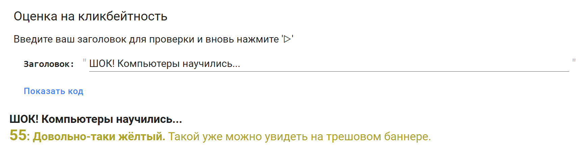
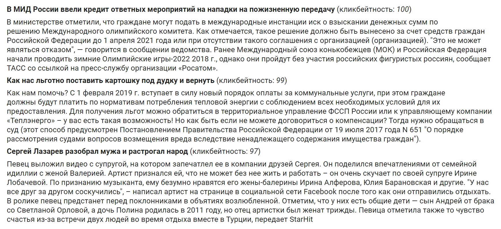

# Нейросетевой анализ текста с кликбейтных баннеров

В этом репозитории представлены средства, разработанные в ходе исследования, описанного в статье «Компьютер учит срамоту»: [метрика](https://colab.research.google.com/github/sysblok/neuroclickbait/blob/master/Score_and_generate.ipynb#scrollTo=k_DGVyralIGP&line=1&uniqifier=1) для оценки произвольных русскоязычных строк на схожесть с кликбейтными заголовками и [нейросетевой генератор](https://colab.research.google.com/github/sysblok/neuroclickbait/blob/master/Score_and_generate.ipynb#scrollTo=HlB8zxEC0PpU) заголовков и текстов новостей в соответствующем стиле.

  

 <i>Пример работы метрики оценки строк на кликбейтность</i> 

  

 <i>Пример работы генератора кликбейтных новостей</i> 

Использованные технологии: [`sentence-transformers`](https://github.com/UKPLab/sentence-transformers), [`aitextgen`](https://github.com/minimaxir/aitextgen) (на модели [`ru_transformers`](https://github.com/mgrankin/ru_transformers)), [`ruGPT3Small`](https://github.com/sberbank-ai/ru-gpts).
